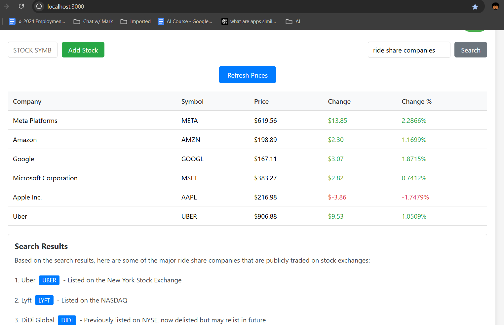
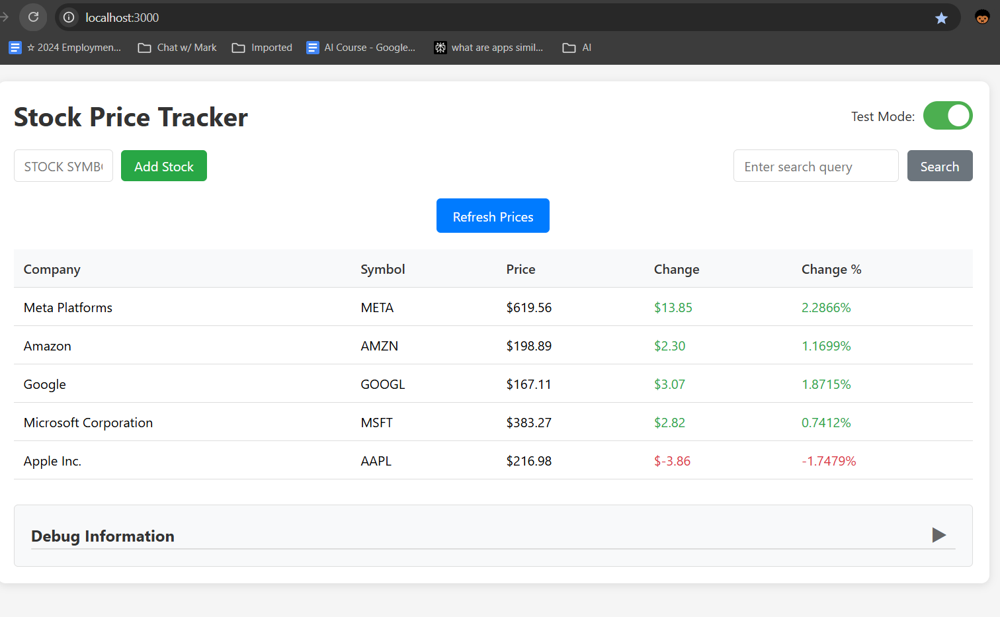

# AI for Business Project Documentation

## Project Overview
The Stock Price Tracker is a web-based application that combines real-time stock data with AI-powered company search capabilities. It provides users with an intuitive interface to track stock prices and search for companies using natural language queries.

## Application Screenshots

### Company Search Interface


### Debug Information and Real-time Updates


## Key Features
- Real-time stock price tracking
- AI-powered company search
- Test mode for development
- Interactive stock symbol buttons
- Detailed debug information

## Tools and APIs Used

### 1. API Configuration
The application uses a configuration file to manage API keys and settings:
- Configuration template provided in `config.template.js`
- Secure storage of API keys and endpoints
- Environment variable support
- [View detailed API configuration guide](api-config-docs.html)

### 2. Alpha Vantage API
Used for retrieving real-time stock market data:
- Endpoint: `https://www.alphavantage.co/query`
- Function: GLOBAL_QUOTE
- Returns: Current stock price, change amount, change percentage
- Rate Limit: 5 API calls per minute

### 3. Perplexity AI API
Used for natural language processing and company search:
- Endpoint: `https://api.perplexity.ai/chat/completions`
- Model: sonar-pro
- Returns: Structured responses with company names and stock symbols
- Features: Context-aware responses, filtering capabilities

### 4. Cursor IDE
Advanced development environment used for code generation and management:
- Features: AI-powered code generation and editing
- Integration: Built-in AI assistant powered by Claude 3.5 Sonnet
- Capabilities: Smart code completion, refactoring, and documentation
- Tools: Semantic search, file management, and debugging support

## Implementation Details
- Test Mode Toggle: Allows switching between live API data and test data
- Company Search: Uses AI to interpret natural language queries
- Stock Symbol Buttons: Automatically populate company name and symbol
- Debug Section: Provides detailed logging of operations and API responses

## Development Notes and Issues

### Challenges and Solutions:
- API Rate Limiting: Implemented test mode to avoid hitting API limits during development
- Company Name Extraction: Added regex pattern matching to clean up company names from search results
- Search Result Processing: Enhanced to handle various response formats and edge cases
- UI/UX Improvements: Added interactive buttons and visual feedback for better user experience

## Recent Updates
- Added Perplexity AI integration for intelligent company search
- Implemented clickable stock symbols in search results
- Enhanced company name extraction from search results
- Added comprehensive debug logging
- Improved error handling and user feedback

## Getting Started

1. Clone the repository:
```bash
git clone https://github.com/kentechops/ai-stock-tracker.git
```

2. Copy `config.template.js` to `config.js` and update with your own Perplexity and Alpha Vantage API keys:
```bash
cp config.template.js config.js
```

3. Open `index.html` in your web browser to start using the application.

## Contributing
Feel free to submit issues and enhancement requests!

## License
This project is licensed under the MIT License - see the LICENSE file for details. 
